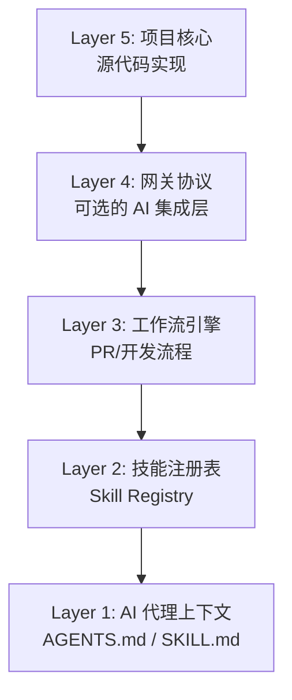
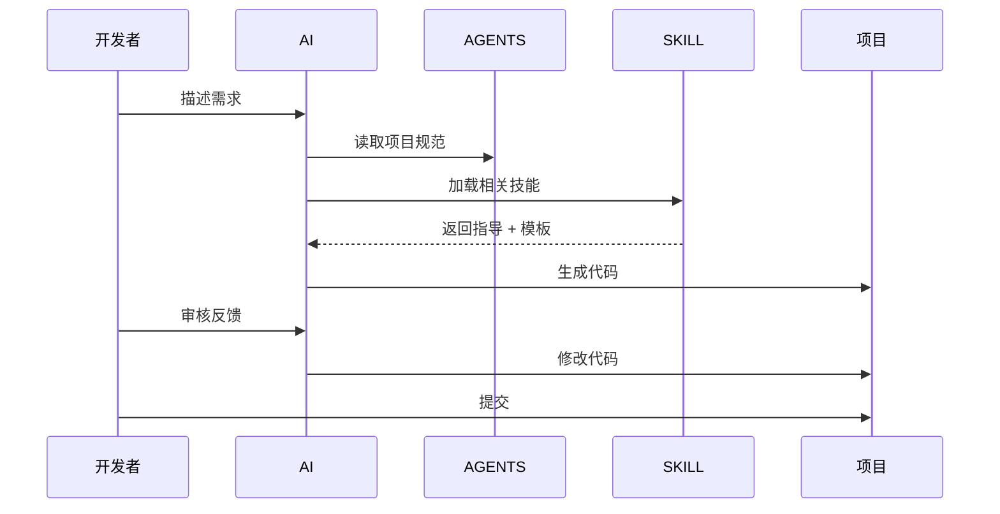

# Vibe Coding 五层架构

Vibe Coding 采用分层架构设计，确保 AI 能够高效、安全地协作开发。



## Layer 1: AI Agent Context（AI 代理上下文）

**作用**：为 AI 提供必要的上下文信息，**更重要的是定义强制执行的工作约定**。

### 组成文件

| 文件 | 用途 | 加载时机 |
|------|------|---------|
| `AGENTS.md` | 项目级开发指南 + AI 约定 | 始终加载 |
| `SKILL.md` | 技能级指导 + AI 约定 | 技能触发时 |
| `references/` | 详细参考资料 | 按需加载 |

### 核心职责

1. **定义约定**：通过 "AI 助手约定" 章节明确规则
   - `[强制]` 必须执行的操作
   - `[禁止]` 绝不能做的操作
   - `[OK]` 推荐的做法

2. **指导行为**：提供工作流程和最佳实践

3. **控制边界**：设定 AI 的操作边界（如禁止 git stash）

### 设计原则

- **约定优先**：SKILL 是规则，不是参考
- **渐进式披露**：AI 只加载需要的信息
- **结构化**：YAML frontmatter + Markdown body
- **中文优先**：所有上下文使用中文编写
- **可强制执行**：约定应具体、可检查

### 示例结构

```markdown
---
name: skill-name
description: 简短描述，让 AI 知道何时使用
---

# 技能名称

## 适用场景
- 场景 1
- 场景 2

## 核心概念
- 概念 1：解释
- 概念 2：解释

## 快速开始
```代码示例```
```

## Layer 2: Skill Registry（技能注册表）

**作用**：存储和管理所有可复用的技能单元。

### 目录结构

```
skills/
├── category/              # 技能分类
│   └── skill-name/        # 具体技能
│       ├── SKILL.md       # 核心指导
│       ├── HISTORY.md     # 变更记录
│       ├── patterns/      # 代码模式
│       │   ├── templates/ # 模板
│       │   └── examples/  # 示例
│       └── references/    # 参考资料
```

### 技能分类示例

```
skills/
├── dev-workflow/          # 开发工作流
│   ├── git-commits/       # Git 提交规范
│   ├── quality-gates/     # 质量门禁
│   └── pr-workflow/       # PR 流程
├── embedded/              # 嵌入式开发
│   ├── mcu/stm32/         # STM32
│   └── rtos/freertos/     # FreeRTOS
└── software/              # 软件开发
    └── docker/            # Docker
```

### 关键特性

- **无版本**：知识只有演进，没有版本号
- **符号链接**：项目通过链接引用技能
- **独立维护**：技能库与项目分离

## Layer 3: Workflow Engine（工作流引擎）

**作用**：标准化开发流程，确保质量。

### 包含的工作流

#### 1. 开发工作流
```
需求描述 → AI 生成方案 → 人工确认 → AI 实现 → 质量门禁 → 提交
```

#### 2. PR 工作流
```
review-pr → prepare-pr → merge-pr
```

#### 3. 技能迭代工作流
```
发现问题 → 记录到 todo → 修改 skill → 提交到 registry → 项目更新链接
```

### 质量门控检查项

- [ ] 代码规范检查
- [ ] 编译/运行验证
- [ ] 测试通过
- [ ] 安全扫描

## Layer 4: Gateway Protocol（网关协议）

**作用**：可选层，用于 IDE 集成和 AI 工具连接。

### 使用场景

- IDE 插件与 AI 服务通信
- 多 AI 代理协调
- 会话状态管理

### 实现方式

- WebSocket/stdio 桥接
- ACP (Agent Client Protocol)
- 自定义协议

## Layer 5: Project Core（项目核心）

**作用**：实际的项目源代码。

### 项目结构

```
my-project/
├── .vibe/                 # Vibe Coding 配置
│   ├── skills/           # 链接的技能
│   └── scripts/          # 辅助脚本
├── .skill-set            # 技能声明
├── AGENTS.md             # 项目开发指南
├── src/                  # 源代码
└── README.md
```

### 与 Skill 库的关系

```
项目 --引用--> Skill Registry
  │               │
  │--链接--- skill-a/
  │--链接--- skill-b/
```

## 层间交互流程

### 场景：开发新功能



## 架构优势

1. **关注点分离**：每层职责清晰
2. **可测试性**：每层可独立验证
3. **可扩展性**：新技能易于添加
4. **可移植性**：技能库跨项目复用

## 下一步

- 了解 [五种核心方法论](methodology.md)
- 学习 [技能设计原则](skill-design.md)
