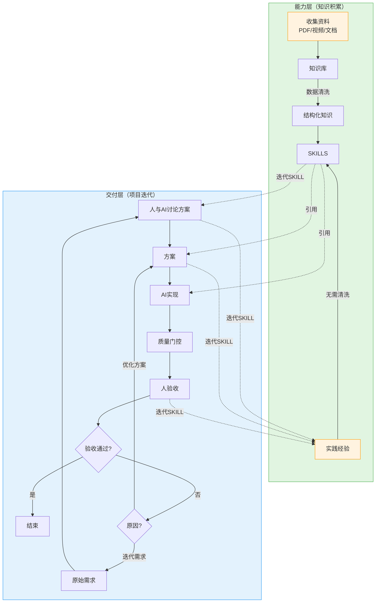
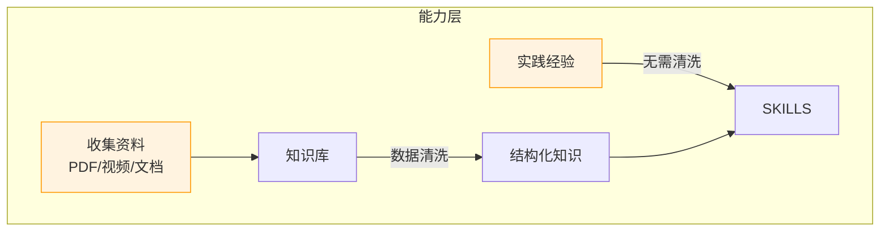

# Vibe Coding 方法论

本文档描述 Vibe Coding 的完整方法论，整合了核心理念、实施流程和最佳实践。

---

## 什么是 Vibe Coding

Vibe Coding 由 Andrej Karpathy 于 2025 年 2 月提出，其核心理念是：**开发者通过自然语言描述需求，AI 工具负责具体的代码实现**。

这种方式将编程从"手写每一行代码"转变为"描述意图并指导 AI 实现"。

**来源**: [Andrej Karpathy - Vibe Coding](https://karpathy.bearblog.dev/vibe-coding-menugen/)

---

## 核心理念（3条）

### 1. 约定优于配置（Convention over Configuration）

**本质**：用强制规则替代临时指令

```
传统方式：每次向 AI 说明"不要 git add ."
Vibe Coding：规则写入 SKILL，AI 自动遵守
```

**关键区别**：
- SKILL ≠ 参考资料（可看可不看）
- SKILL = 强制执行的工作约定（必须遵循）

### 2. 渐进式披露（Progressive Disclosure）

**本质**：AI 按需加载，避免上下文爆炸

```
Level 1: Metadata（元数据）     ~100 tokens
    ↓ 触发条件匹配
Level 2: SKILL.md Body          ~2k-5k tokens
    ↓ AI 判断需要
Level 3: References             无限制
```

**实践**：
- SKILL.md 保持精简（< 500 行）
- 详细内容放入 references/
- 明确说明何时加载 reference

### 3. 学习中演进

**本质**：被动式经验沉淀，能力持续成长

```
项目交付中发现问题
       │
       ▼
快速记录 → 整理到 SKILL
       │
       ▼
能力层升级 → 支撑更好的交付
```

**触发机制**：被动式，遇到问题才更新

---

## 两种层次结构



### 能力层

**定义**：知识积累和能力建设

**两条输入路径**：



**路径1：主动学习（外部知识）**

```
收集资料（PDF/视频/文档）
        ↓
数据清洗（PDF转MD/视频转笔记）
        ↓
提取关键知识
        ↓
创建/更新 SKILL
```

**特点**：
- 需要数据清洗和结构化
- 外部信息需要消化转换
- 类似人学习做笔记的过程

**路径2：实践沉淀（内生经验）**

```
项目实践（开发/测试/验收）
        ↓
发现问题或模式
        ↓
直接写入 SKILL（无需清洗）
        ↓
能力立即升级
```

**特点**：
- 第一手经验，立即可用
- AI自测结果或人手写规则
- 无需复杂的转换处理

**对比**：

| 维度 | 主动学习 | 实践沉淀 |
|------|----------|----------|
| 来源 | 外部资料 | 内生经验 |
| 处理 | 需要数据清洗 | 无需清洗 |
| 时效 | 较慢 | 即时 |
| 典型场景 | 学习新技术 | 项目中发现模式 |

### 交付层

**定义**：具体项目的开发迭代

**流程**：
```
原始需求
    ↓
人与AI讨论方案
    ↓
AI实现（引用SKILLS）
    ↓
质量门控
    ↓
人验收
    ↓
├── 通过 → 结束
└── 不通过 → 改需求/优化方案
```

**人验收后的选择**：

| 选择 | 流向 | 说明 |
|------|------|------|
| 改需求 | 交付层迭代 | 需求理解有偏差，重新讨论方案 |
| 优化方案 | 交付层迭代 | 方案有问题，调整实现方式 |
| 沉淀经验 | 能力层提升 | 发现通用问题，更新 SKILL |

---

## 三种约定层次

### 全局约定（Global Convention）

**定义**：AI 的"本性"原则，跨领域通用

**载体**：`vibe-coding/core` 等核心 Skill

**示例**：
- 禁止擅自扩展
- 推送确认流程
- 渐进式披露原则

**演进**：从多次项目经验中升华，变更需慎重

### 能力约定（Capability Convention）

**定义**：领域内做事方法，类似个人知识习惯

**载体**：各 SKILL.md 文件

**结构**：
```
skills/
├── vibe-coding/                  # Vibe Coding 核心
│   ├── core/                     # 全局约定
│   ├── multi-agent-safety/       # 安全规则
│   └── session-management/       # 会话管理
├── dev-workflow/
│   ├── git-commits/              # Git 提交习惯
│   └── quality-gates/            # 质量检查习惯
├── embedded/
│   └── mcu/st-stm32/             # STM32 开发习惯
└── software/
    └── docker-best-practices/    # Docker 使用习惯
```

**粒度原则**：先从大开始，出现问题再拆分

**演进**：项目经验沉淀，HISTORY.md 记录演进

### 项目/任务约定（Project/Task Convention）

**定义**：具体场景的附加约束

**载体**：AGENTS.md、任务描述

**示例**：
- 本项目必须使用 HAL 库
- 堆内存限制 64KB
- 本次任务使用环形缓冲区

**特点**：临时性，可覆盖上层约定

---

## 实施流程（五阶段）

### 阶段一：需求与方案讨论

**参与者**：人主导，AI 协助

**目标**：将模糊需求转化为清晰方案

**步骤**：
1. 人提供原始需求
2. 人与 AI 讨论细化（澄清模糊点、识别约束、讨论方案）
3. 输出明确实施方案

**关键实践**：
- 要求 AI 先输出方案再实施
- 使用 PRD 模板记录需求
- 人做最终决策

### 阶段二：技能库准备

**参与者**：人与 AI 协作

**目标**：确保 AI 拥有所需知识

**步骤**：
1. 识别所需技能
2. 检查技能库
3. 加载相关 SKILL
4. 知识补充（如不足则创建新技能）

### 阶段三：AI 实现

**参与者**：AI 主导，人监督

**目标**：完成代码实现

**步骤**：
1. 加载上下文和技能
2. 生成代码
3. 自测验证
4. 交付结果

**关键实践**：
- 遵循所有三层约定
- 保持对话聚焦
- 当 AI 困惑时重置上下文

### 阶段四：质量门控

**参与者**：AI 执行

**目标**：自动化检查基础质量

**标准流水线**：
```bash
lint-check → type-check → build-check → test-check
```

**嵌入式项目检查项**：
- [ ] 代码可编译（零警告）
- [ ] 静态分析通过
- [ ] 代码格式符合规范

### 阶段五：人验收

**参与者**：人主导

**目标**：验证结果，决定下一步

**验收维度**：

| 维度 | 检查内容 |
|------|----------|
| 功能正确性 | 是否实现需求 |
| 代码质量 | 是否简洁清晰 |
| 安全性 | 是否存在漏洞 |
| 可维护性 | 是否易于理解修改 |
| 性能 | 是否满足要求 |

**验收后的选择**：

```
人验收
    │
    ├── 通过 ────────► 结束
    │
    ├── 改需求 ──────► 阶段一（重新讨论方案）
    │
    ├── 优化方案 ────► 阶段三（重新实现）
    │
    └── 沉淀经验 ────► 更新 SKILL（能力层提升）
              └──► 阶段一（用新能力继续）
```

---

## 支撑机制

### 上下文管理

**`.ai-context/` 目录**：
```
project-root/
├── .ai-context/
│   ├── session-2026-02-11.md      # 关键决策摘要
│   └── full-logs/                 # 可选：完整对话
└── .gitignore                     # 忽略 .ai-context/
```

**AI 进入项目时**：
1. 检查 `.ai-context/` 是否存在
2. 读取最新 session
3. 确认理解目标和决策
4. 无 session 时询问是否创建

### 多代理安全规则

**绝对禁止**：
- `git stash`
- `git checkout`（除非明确要求）
- `git add -A` 或 `git add .`
- `git push`（无明确确认）
- 修改 `.worktrees/`

**推送确认流程**：
```
用户明确说"推送"/"push" → 二次确认 → 执行 push
用户未明确说 → 必须询问 → 等待明确回复
```

详见 `vibe-coding/multi-agent-safety` skill。

---

## 最佳实践

### 提示工程

**三层结构**（关键节点使用）：
1. 技术上下文和约束
2. 功能需求和用户故事
3. 集成和边界情况

**自然对话为主**：
- 初始需求保持简洁
- 通过多轮对话逐步细化
- 技能库减少重复描述

### 版本控制

**精确提交**：
```bash
# [OK]
git add src/file1.c src/file2.h
git commit -m "feat(gpio): add interrupt debounce"

# [X]
git add .
git commit -am "update"
```

**Commit Message 格式**：`type(scope): subject`

### 安全实践

| 风险 | 防护措施 |
|------|----------|
| 提示注入 | 验证输入，限制 AI 权限 |
| 不安全模式 | 代码审查，密钥管理 |
| 供应链攻击 | 审查依赖，固定版本 |

---

## 常见陷阱与避免

### 陷阱一：过度依赖 AI

**表现**：完全不理解生成的代码，盲目部署

**避免**：
- 始终阅读并理解代码
- 要求 AI 解释复杂逻辑
- 建立代码审查流程

### 陷阱二：上下文爆炸

**表现**：AI 因上下文过多而困惑

**避免**：
- 保持对话聚焦
- 定期重置上下文
- 使用技能库按需加载

### 陷阱三：知识孤岛

**表现**：项目经验无法复用

**避免**：
- 及时沉淀到技能库
- 维护 HISTORY.md
- 定期回顾更新技能

---

## 参考资源

### 核心文献

1. Andrej Karpathy - Vibe Coding 原始定义
   - https://karpathy.bearblog.dev/vibe-coding-menugen/

2. Stack Overflow Developer Survey 2025
   - https://survey.stackoverflow.co/2025/

### 最佳实践指南

- Clarifai - Vibe Coding Explained
- Softr - Vibe Coding Best Practices
- Supabase - Vibe Coding Best Practices for Prompting

---

## 迭代记录

- 2026-02-12: 整合核心理念、三种约定层次、五阶段流程，明确能力层与交付层的双层结构
