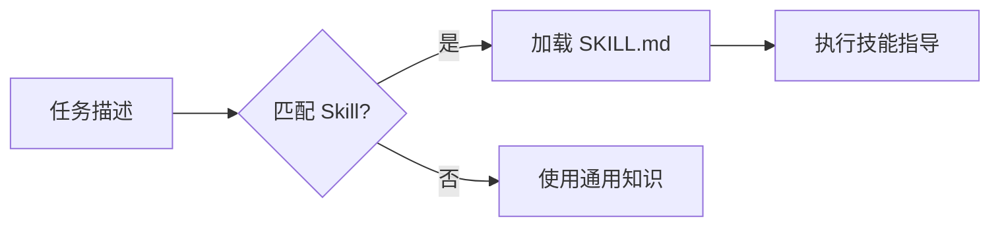
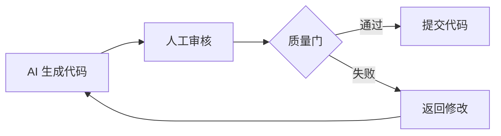
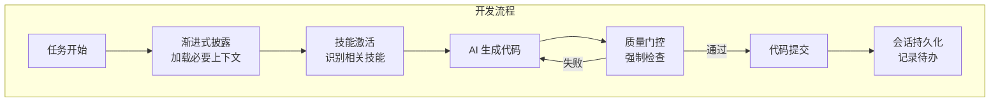

# 四种核心方法论

Vibe Coding 基于四种核心方法论，确保 AI 协作开发的高效性和可靠性。

## 1. 渐进式披露（Progressive Disclosure）

### 概念

AI 只加载当前需要的信息，避免上下文窗口浪费。

### 三级加载机制

```
Level 1: Metadata（元数据）      ~100 tokens
    ↓ 触发条件匹配
Level 2: SKILL.md Body           ~2k-5k tokens
    ↓ AI 判断需要
Level 3: References              无限制
```

### 实现方式

#### Level 1: Metadata（始终加载）
```yaml
---
name: skill-name
description: 详细描述，包含触发关键词
---
```

AI 通过 description 判断是否触发该 skill。

#### Level 2: SKILL.md Body（触发后加载）
```markdown
# 技能名称

## 适用场景
何时使用此技能

## 核心概念
关键知识点

## 快速开始
代码示例
```

#### Level 3: References（按需加载）
```markdown
## 参考资料
- references/detailed-guide.md  # 需要时读取
- references/api-reference.md   # 需要时读取
```

### 最佳实践

- SKILL.md 保持精简（< 500 行）
- 大文档拆分到 references/
- 明确说明何时加载 reference

## 2. 技能激活（Skill Activation）

### 概念

AI 根据任务自动识别并激活相关技能。

### 触发方式

#### 方式 1：显式声明
项目在 `.skill-set` 中声明技能：
```
embedded/mcu/st-stm32
dev-workflow/git-commits
```

#### 方式 2：关键词匹配
Skill 的 description 包含触发关键词：
```yaml
description: STM32 MCU development... Use when implementing STM32...
```

#### 方式 3：文件模式匹配
```yaml
triggers:
  - file_pattern: "**/*.c"
  - file_pattern: "**/*.h"
```

### 激活流程



## 3. 会话持久化（Session Persistence）

### 概念

保持开发会话的连续性，支持中断恢复。

### 会话键格式

```
{agent}:{scope}:{context}

示例:
- claude:stm32-gpio:config
- gpt4:docker-setup:debug
```

### 持久化内容

| 内容 | 用途 |
|------|------|
| 对话历史 | 保持上下文连贯 |
| 技能加载记录 | 避免重复加载 |
| 用户偏好 | 个性化设置 |
| 待办事项 | `.skill-updates-todo.md` |

### 项目级持久化

```
.vibe/
├── .skill-updates-todo.md    # 技能更新待办
├── backups/                  # 文件备份
└── sessions/                 # 会话记录（可选）
```

## 4. 质量门控（Quality Gates）

### 概念

AI 生成的代码必须通过预定义的检查才能提交。

### 标准质量门流水线

```bash
# Gate 1: 静态检查
lint-check

# Gate 2: 类型检查
type-check

# Gate 3: 构建检查
build-check

# Gate 4: 测试检查
test-check
```

### 嵌入式项目质量门

```bash
#!/bin/bash
# gate.sh

echo "🔍 运行质量门禁..."

# 1. 编译检查（零警告）
make clean
make 2>&1 | tee build.log
if grep -i "warning" build.log; then
    echo "❌ 存在编译警告"
    exit 1
fi

# 2. 静态分析
if command -v cppcheck >/dev/null; then
    cppcheck --enable=all --error-exitcode=1 src/
fi

# 3. 代码格式
clang-format --dry-run --Werror src/*.c

echo "✅ 质量门禁通过"
```

### 质量门触发时机



### 强制检查项

- [ ] 代码可编译
- [ ] 无编译警告（`-Wall -Werror`）
- [ ] 静态分析通过
- [ ] 测试通过
- [ ] 符合项目规范

## 四种方法论的协同



## 最佳实践

1. **渐进式披露**：保持 SKILL.md 精简，详细内容放 references/
2. **技能激活**：在 description 中明确触发条件
3. **会话持久化**：定期整理 `.skill-updates-todo.md`
4. **质量门控**：根据项目特点定制检查项

## 下一步

- 了解 [多代理安全规则](multi-agent.md)
- 学习 [实施流程](workflow.md)
