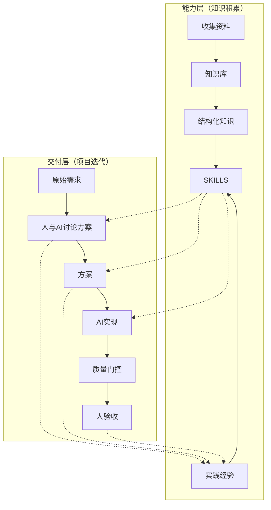

# 实施流程

## 总体流程



## 四阶段实施

### 第一阶段：构建知识库

**目标**：将外部知识和实践经验转化为结构化 Skill

**两条路径**：

| 路径 | 适用场景 | 关键原则 |
|------|----------|----------|
| 主动学习 | 学习新技术、新框架 | 资料清洗 → 提取知识 → 创建 Skill |
| 实践沉淀 | 项目中发现模式 | 直接记录 → 整理成 Skill → 立即复用 |

### 第二阶段：创建 Skill

**原则**：
- 知识无版本：用 HISTORY.md 记录演进
- 渐进式披露：SKILL.md < 500 行，详细内容放 references/
- 从实践中来：只记录验证过的知识

**结构**：
```
skill-name/
├── SKILL.md          # 核心指导（必须）
├── HISTORY.md        # 变更记录
├── patterns/         # 代码模式（可选）
└── references/       # 参考资料（可选）
```

### 第三阶段：项目开发

**准备**：
1. 初始化项目（`vibe init`）
2. 声明所需 Skill（`.skill-set`）
3. 链接 Skill（`vibe update`）

**开发循环**：
```
描述需求 → AI实现 → 质量门禁 → 人验收
    ↑                              |
    └──────── 迭代优化 ←───────────┘
```

### 第四阶段：持续迭代

**Skill 迭代**：
```
项目开发 → 发现问题 → 记录待办 → 更新Skill → 提交到Registry
                ↑                              |
                └────── 其他项目受益 ←─────────┘
```

**快速记录**：在项目 `.vibe/.skill-updates-todo.md` 中记录发现

---

## 关键原则

### 1. 知识分层

- **原始资料**：保存但不频繁访问
- **精炼笔记**：结构化整理
- **Skill**：AI 可直接使用

### 2. 技能粒度

- **通用技能**：所有项目用（如 git-commits）
- **领域技能**：一类项目用（如 stm32）
- **项目技能**：单个项目用

### 3. 渐进采用

第一阶段：只用核心 skill
第二阶段：添加领域相关 skill
第三阶段：完善项目专属 skill

---

## 参考

具体操作请参考：
- `vibe-coding/skill-evolution` - Skill 创建和演化流程
- `vibe-coding/skill-testing` - Skill 测试验证
- `templates/AGENTS.md` - 项目模板
