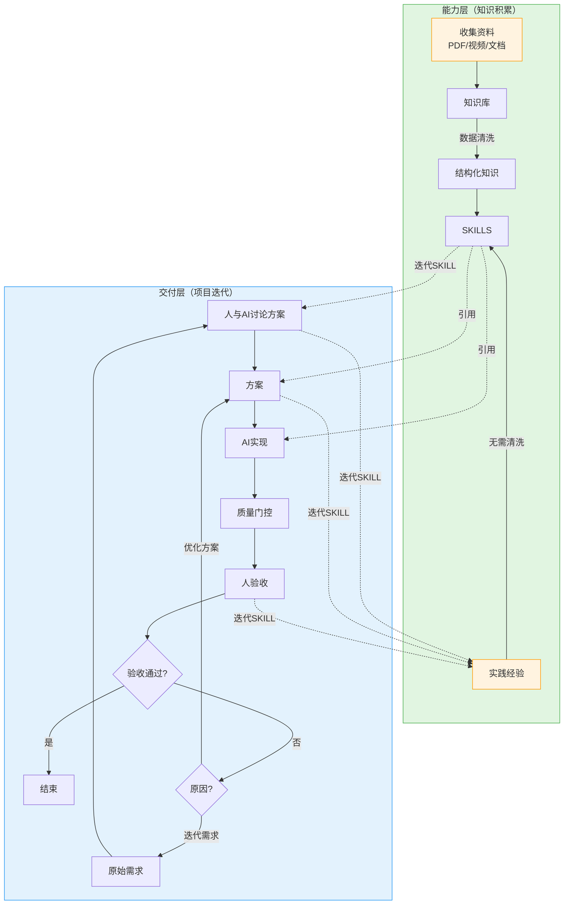
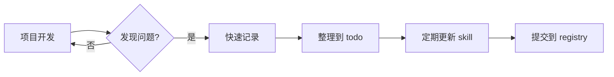

# 实施流程与最佳实践

Vibe Coding 的完整实施流程，从知识收集到实际开发。

## 总体流程



## 第一阶段：构建知识库

### 1. 收集资料

**来源**：
- 官方文档（PDF/HTML）
- 技术书籍
- 视频教程
- 实际项目代码

**存储**：
```
knowledge-base/           # 原始资料（人维护）
├── docs/                 # 文档
├── videos/               # 视频（笔记）
└── code/                 # 参考代码
```

### 2. 数据清洗

**PDF → Markdown**：
```bash
# 使用工具转换
marker pdf-file.pdf --output md/

# 人工审核，提取关键章节
# 删除：版权声明、空白页、索引
# 保留：核心概念、配置步骤、API 列表
```

**视频 → 笔记**：
```markdown
video: "RTOS 任务调度讲解"
timestamp: "12:34"
topic: "优先级反转"
key_points:
  - 高优先级任务等待低优先级任务
  - 解决方案：优先级继承
  - 代码示例：xSemaphoreTake 的使用
code_snippet: |
  xSemaphoreTake(mutex, portMAX_DELAY);
```

### 3. 提取知识

从清洗后的资料中提取：
- **代码模式**：常用代码片段
- **配置步骤**：标准操作流程
- **踩坑记录**：问题和解决方案
- **速查表**：常用参数/API

## 第二阶段：创建 Skill 库

### 1. 创建 Skill

```bash
# 使用脚本创建框架
cd ~/skills-registry
./scripts/new-skill.sh embedded/mcu/gd32

# 编辑内容
vim skills/embedded/mcu/gd32/SKILL.md
```

### 2. 组织技能

```
skills/
├── embedded/
│   ├── common/           # 先创建通用概念
│   ├── mcu/
│   │   ├── st-stm32/     # 再创建具体实现
│   │   └── gd32/
│   └── rtos/
```

### 3. 测试 Skill

```bash
# 创建测试项目
cd /tmp
mkdir test-skill
cd test-skill

# 初始化并引用技能
~/skills-registry/scripts/init-vibe.sh
# 添加技能到 .skill-set
echo "embedded/mcu/st-stm32" >> .skill-set
./.vibe/scripts/link-skills.sh

# 让 AI 使用技能生成代码
# 验证输出是否符合预期
```

## 第三阶段：项目开发

### 1. 初始化项目

```bash
# 进入项目目录（可以是已有项目）
cd ~/projects/my-embedded-project

# 初始化 Vibe Coding
vibe init

# 或使用完整命令
~/skills-registry/scripts/init-vibe.sh
```

生成结构：
```
my-embedded-project/
├── .vibe/                # Vibe 配置
│   ├── skills/           # 链接的技能
│   ├── scripts/          # 辅助脚本
│   └── backups/          # 文件备份
├── .ai-context/          # AI 会话上下文（Git 忽略内容）
│   └── .gitkeep          # 确保目录被跟踪
├── .skill-set            # 技能声明
├── AGENTS.md             # AI 开发指南
└── .gitignore            # 忽略规则
```

**关于 `.ai-context/`**：
- 用于保存 AI 会话记录，支持上下文恢复
- 内容由 AI 自动管理，用户无需手动操作
- 目录被 Git 跟踪，但内容被忽略
- 恢复上下文后建议删除旧文件避免堆积

### 2. 配置技能

编辑 `.skill-set`：
```
# Vibe Coding 核心
vibe-coding/core
vibe-coding/multi-agent-safety
vibe-coding/session-management

# 开发工作流
dev-workflow/git-commits
dev-workflow/quality-gates

# 嵌入式技能
embedded/common/c-embedded
embedded/mcu/st-stm32
embedded/rtos/freertos

# 软件技能
software/docker-best-practices
```

链接技能：
```bash
vibe update
# 或
.vibe/scripts/link-skills.sh
```

### 3. AI 协作开发

#### 场景 1：开发新功能

**你**：
```markdown
我要添加一个 GPIO 中断处理功能：
- 使用 PA5 作为外部中断输入
- 下降沿触发
- 中断服务程序中切换 LED 状态

请参考 st-stm32 skill 实现。
```

**AI**：
1. 读取 `.skill-set` 确定可用技能
2. 加载 `st-stm32` skill
3. 分析 `patterns/templates/exti-interrupt.c`
4. 生成代码：
```c
void HAL_GPIO_EXTI_IRQHandler(uint16_t GPIO_Pin) {
    if(__HAL_GPIO_EXTI_GET_IT(GPIO_PIN_5) != RESET) {
        __HAL_GPIO_EXTI_CLEAR_IT(GPIO_PIN_5);
        HAL_GPIO_TogglePin(LED_GPIO_Port, LED_Pin);
    }
}
```

**你**：审核代码，确认无误

**AI**：运行质量门禁
```bash
./scripts/gate.sh
```

**你**：提交代码
```bash
./scripts/commit.sh "feat(gpio): add PA5 EXTI interrupt" \
    src/interrupt.c src/interrupt.h
```

#### 场景 2：发现问题

**你**：发现中断持续触发，程序卡死

**AI**：分析原因
- 发现 `__HAL_GPIO_EXTI_CLEAR_IT()` 未调用
- 查阅 skill，发现常见问题章节有记录

**你**：请更新 skill，补充这个常见错误

**AI**：
```bash
# 更新 skill
cd ~/skills-registry
vim skills/embedded/mcu/st-stm32/SKILL.md
# 添加 troubleshooting 条目

git commit -am "fix(stm32): add EXTI flag clearing warning"
```

**你**：回到项目，更新 skill 链接
```bash
cd ~/projects/my-project
vibe update
```

## 第四阶段：持续迭代

### Skill 迭代流程



### 快速记录模板

在项目 `.vibe/.skill-updates-todo.md`：
```markdown
## 待办

- [ ] stm32-gpio: 补充 H7 PWR 配置
  发现时间：2026-02-11
  项目：my-robot
  问题描述：H7 系列需要配置 PWR 寄存器才能使用某些 GPIO
  参考：项目代码 src/power.c 第 45 行
  
- [ ] freertos: 添加内存管理说明
  发现时间：2026-02-11
  问题描述：堆大小配置不当导致申请失败
```

### 定期整理

每周一次：
```bash
# 1. 查看所有项目的待办
find ~/projects -path "*/.vibe/.skill-updates-todo.md" -exec cat {} \;

# 2. 更新 skills-registry
cd ~/skills-registry
# 修改相关 skill

git add .
git commit -m "fix: update skills based on project feedback"
git push

# 3. 更新所有项目
for dir in ~/projects/*; do
    if [ -f "$dir/.skill-set" ]; then
        (cd "$dir" && vibe update)
    fi
done
```

## 最佳实践

### 1. 知识分层（能力层）

**路径1：主动学习（外部知识）**
```
原始资料（PDF/视频/文档）     # 保存，不频繁访问
    ↓ 数据清洗
精炼笔记                      # 结构化整理
    ↓ 封装
Skill                        # AI 可用
```

**路径2：实践沉淀（内生经验）**
```
项目实践
    ↓ 发现问题
经验总结                      # 直接写入，无需清洗
    ↓ 
Skill                        # 立即可用
```

### 2. 技能粒度

- **通用技能**：dev-workflow/git-commits（所有项目用）
- **领域技能**：embedded/mcu/st-stm32（一类项目用）
- **项目技能**：project-specific/（单个项目用）

### 3. 渐进采用

第一阶段：只用 `git-commits` skill
第二阶段：添加嵌入式相关 skill
第三阶段：完善项目专属 skill

### 4. 保持简洁

- 不要一次创建太多 skill
- 先有项目，再提取 skill
- 从简单开始，逐步完善

## 常见问题

### Q: Skill 和原始资料的关系？

**A**: 
- 原始资料 = 原材料（大而全）
- Skill = 精炼后的工具（精而准）
- 关系：Skill 是原始资料的子集 + 重构

### Q: 如何处理更新冲突？

**A**:
- Skill 库是单点维护（你维护）
- 项目通过符号链接引用
- 更新 Skill 后，所有项目 `vibe update`

### Q: 多项目如何共享？

**A**:
- Skill 库存放在独立仓库
- 所有项目链接到同一 Skill 库
- 符号链接确保空间效率

## 检查清单

开始新项目：
- [ ] 确定技术栈
- [ ] 选择相关 skill
- [ ] 运行 `vibe init`
- [ ] 编辑 `.skill-set`
- [ ] 运行 `vibe update`
- [ ] 定制 `AGENTS.md`

开发过程中：
- [ ] 遇到问题记录到 todo
- [ ] 定期更新 skill
- [ ] 通过质量门禁提交

## 下一步

- 阅读 [术语表](glossary.md)
- 参考现有 skill 示例
- 开始你的第一个 Vibe Coding 项目
