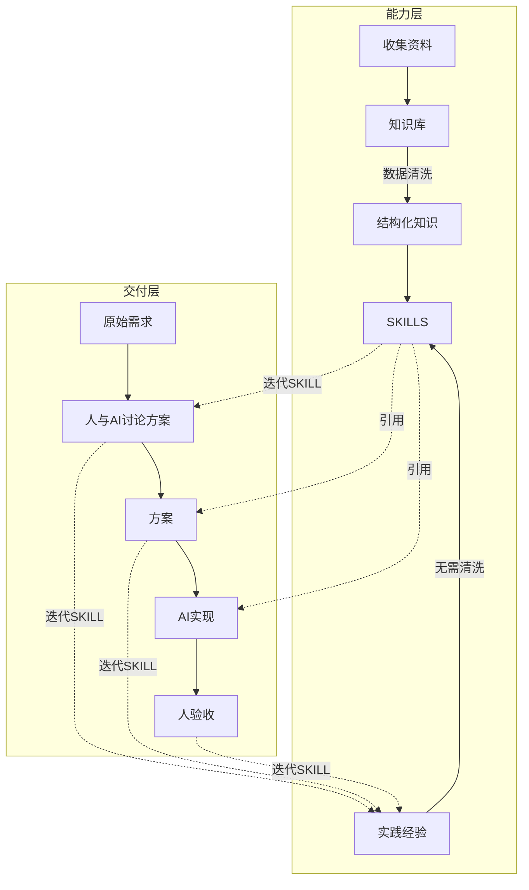

# Vibe Coding 全局约定

## 核心理念

### 1. 约定优于配置（Convention over Configuration）

**本质**：用强制规则替代临时指令

```
传统方式：每次向 AI 说明"不要 git add ."
Vibe Coding：规则写入 SKILL，AI 自动遵守
```

**关键区别**：
- SKILL ≠ 参考资料（可看可不看）
- SKILL = 强制执行的工作约定（必须遵循）

### 2. 渐进式披露（Progressive Disclosure）

**本质**：AI 按需加载，避免上下文爆炸

```
Level 1: Metadata（元数据）     ~100 tokens
    ↓ 触发条件匹配
Level 2: SKILL.md Body          ~2k-5k tokens
    ↓ AI 判断需要
Level 3: References             无限制
```

**实践**：
- SKILL.md 保持精简（< 500 行）
- 详细内容放入 references/
- 明确说明何时加载 reference

### 3. 学习中演进

**本质**：被动式经验沉淀，能力持续成长



**关键洞察**：
- **方案讨论阶段**就可能发现做事方法需要改进（如：讨论 GPIO 中断时发现 SKILL 中缺少标志清除的说明）
- **优化方案阶段**也可能更新 SKILL（如：发现更优的内存管理方式）
- SKILL 更新后会**立即影响**后续方案的制定（体现"迭代SKILL"的双向箭头）

**触发机制**：被动式
- 遇到问题才更新 SKILL
- 项目结束回顾时选择性沉淀
- 不强制每个项目都更新

---

## 三种约定层次

### 全局约定（Global Convention）

**定义**：AI 的"本性"原则，跨领域通用

**载体**：
- 本 SKILL（vibe-coding）
- vibe-coding/multi-agent-safety

### [强制] 约定优先于实现

**本质**：严格遵守声明的 Skill 规范，没有"临时方案"

```
传统方式：先跑起来，后面再优化
Vibe Coding：第一次就按规范实现
```

**为什么 AI 必须遵守**：
| 人类开发者 | AI 助手 |
|-----------|---------|
| 会疲劳，代码量大了会疏忽 | 不会疲劳，注意力始终一致 |
| 有 deadline，需要妥协 | 没有时间压力 |
| 可能忘记查阅文档 | 可以随时查阅 skill |
| 需要试错来学习 | 可以直接应用最佳实践 |

**禁止行为**：
- ❌ **没有"临时方案"**："先跑起来，后面再优化到文件"
- ❌ **没有"遗漏的约定"**：关注了核心功能，忽略了 skill 约束
- ❌ **没有"部分遵守"**：大部分代码符合规范，关键部分硬编码

**正确做法**：
- ✅ **完整阅读 skill 后再编码**：理解所有 [强制] 条款
- ✅ **一步到位**：不需要迭代修正，第一次就做对
- ✅ **持续验证**：编码过程中持续检查是否符合规范

**违规承认模板**：
```markdown
## 错误承认

**违反的约定**: [skill-name] [强制] 条款
**具体行为**: [描述做了什么]
**正确行为**: [描述应该做什么]
**原因分析**: [诚实分析，不找借口]
**立即修复**: [修复措施]
```

### [禁止] 擅自扩展
- [X] 不要擅自创建用户未要求的文件
- [X] 不要添加超出指令范围的功能
- [X] 不要以"优化"为由添加额外内容

### [强制] 推送确认流程
AI 执行 git push 前必须获得明确确认

**演进方式**：
- 多次项目后发现跨领域通用原则
- 由具体项目经验升华而来
- 变更需慎重，影响所有项目

### 能力约定（Capability Convention）

**定义**：领域内做事方法，类似个人知识习惯

**载体**：各 SKILL.md 文件

**结构**：
```
skills/
├── dev-workflow/
│   ├── git-commits/          # Git 提交习惯
│   └── quality-gates/        # 质量检查习惯
├── embedded/
│   ├── mcu/st-stm32/         # STM32 开发习惯
│   └── rtos/freertos/        # FreeRTOS 使用习惯
└── software/
    └── docker-best-practices/ # Docker 使用习惯
```

**粒度原则**：
- 先从大开始（如 st-stm32 包含所有 STM32 知识）
- 出现上下文问题时再拆分
- AI 维护为主，粒度不是大问题

**演进方式**：
- 项目经验沉淀到 SKILL
- 通过 HISTORY.md 记录演进
- 知识无版本，持续迭代

### 项目/任务约定（Project/Task Convention）

**定义**：具体场景的附加约束

**载体**：
- AGENTS.md 中的"项目特定规则"
- 任务描述中的明确约束
- TODO 注释

**示例**：
```markdown
## 项目特定规则
- 本项目必须使用 HAL 库，禁止寄存器操作
- 堆内存限制 64KB
- 本次任务使用环形缓冲区实现
```

**特点**：
- 临时性，项目结束可能失效
- 可以覆盖或补充全局/能力约定
- 人在任务开始时定义

---

## 三种约定的关系

```
┌─────────────────────────────────────┐
│          全局约定                    │
│    （本性原则，跨领域通用）           │
│         vibe-coding skill           │
└─────────────┬───────────────────────┘
              │ 原则升华
              ▼
┌─────────────────────────────────────┐
│          能力约定                    │
│    （领域知识，做事习惯）             │
│      git-commits / stm32 ...        │
└─────────────┬───────────────────────┘
              │ 经验沉淀
              ▼
┌─────────────────────────────────────┐
│        项目/任务约定                  │
│    （具体场景，临时约束）             │
│         AGENTS.md / 任务描述          │
└─────────────┬───────────────────────┘
              │
              ▼
         具体任务执行
```

**重要原则**：
- 上层约定可以被下层覆盖（显式声明）
- 默认情况下，三层约定同时生效
- 冲突时，项目/任务约定优先

---

## 实施流程（五阶段）

```
阶段一：需求与方案讨论
    - 参与者：人主导，AI 协助
    - 输出：实施方案
    - 关键：人始终是决策者

阶段二：技能库准备
    - 参与者：协作
    - 输出：加载相关 SKILL
    - 关键：根据方案识别所需能力

阶段三：AI 实现
    - 参与者：AI 主导，人监督
    - 输出：代码 + 自测报告
    - 关键：AI 遵循所有三层约定

阶段四：质量门控
    - 参与者：AI 执行
    - 输出：检查通过/失败
    - 关键：自动化检查，不跳过

阶段五：人验收
    - 参与者：人主导
    - 输出：验收结果 + 经验沉淀
    - 关键：人验收不可跳过，沉淀到 SKILL
```

---

## 学习中演进的具体机制

### 能力层的两条输入路径

**路径1：主动学习（外部知识）**

```
收集资料（PDF/视频/文档/教程）
        ↓
数据清洗（PDF转Markdown/视频转笔记）
        ↓
提取关键知识 → 结构化整理
        ↓
创建/更新 SKILL
```

**特点**：
- 外部信息需要消化转换
- 类似人学习做笔记的过程
- 需要数据清洗和验证

**路径2：实践沉淀（内生经验）**

```
项目实践（开发/测试/验收）
        ↓
发现问题或通用模式
        ↓
快速记录 → 直接写入 SKILL（无需清洗）
        ↓
能力立即升级
```

**特点**：
- 第一手经验，立即可用
- AI自测结果或人手写规则
- 无需复杂的转换处理

### 实践沉淀的详细流程

```
项目开发中发现问题
        │
        ▼
快速记录（项目内）
        │
        ├───► .vibe/.skill-updates-todo.md
        │
        ▼
定期整理（人主导）
        │
        ├───► 判断是否有通用价值
        │
        ▼
更新 SKILL（直接写入，无需清洗）
        │
        ├───► 修改对应 SKILL.md
        ├───► 更新 HISTORY.md
        │
        ▼
能力约定升级
```

### 快速记录模板

在项目 `.vibe/.skill-updates-todo.md`：

```markdown
## 待办

- [ ] stm32-gpio: 补充 H7 PWR 配置
  发现时间：2026-02-11
  项目：my-robot
  问题描述：H7 系列需要配置 PWR 寄存器
  参考：src/power.c 第 45 行
```

### SKILL 更新原则

**DO**：
- [OK] 只记录验证过的知识
- [OK] 用 HISTORY.md 记录演进
- [OK] 从具体项目中提取通用模式
- [OK] 保持渐进式披露结构

**DON'T**：
- [X] 不要预设计未验证的知识
- [X] 不要强制版本号
- [X] 不要一次创建太多 skill

---

## 上下文管理

### .ai-context/ 目录

**用途**：保存会话上下文，支持中断恢复

**结构**：
```
project-root/
├── .ai-context/
│   ├── session-2026-02-11.md      # 关键决策摘要
│   ├── session-2026-02-12.md
│   └── full-logs/                 # 可选：完整对话记录
│       └── log-2026-02-11.json
├── AGENTS.md
└── .gitignore                     # 忽略 .ai-context/
```

**两种模式**：

| 模式 | 内容 | 适用场景 |
|------|------|----------|
| 摘要模式 | AI 总结的关键决策 | 默认，依赖 AI 能力 |
| 全量模式 | 完整对话导出 | 工具支持时 |

**AI 进入项目时的流程**：
```
1. 检查 .ai-context/ 是否存在
2. 读取最新 session 文件
3. 确认理解：
   - 当前开发目标
   - 已做关键决策
   - 下一步任务
4. 如无 session，询问用户是否创建
```

---

## 质量门控

**位置**：阶段四（AI 实现之后，人验收之前）

**目的**：自动化检查，确保基础质量

**标准流水线**：
```bash
# Gate 1: 静态检查
lint-check

# Gate 2: 类型检查
type-check

# Gate 3: 构建检查
build-check

# Gate 4: 测试检查
test-check
```

**嵌入式项目示例**：
```bash
# 1. 编译检查（零警告）
make clean
make 2>&1 | tee build.log
if grep -i "warning" build.log; then
    echo "[X] 存在编译警告"
    exit 1
fi

# 2. 静态分析
cppcheck --enable=all --error-exitcode=1 src/

# 3. 代码格式
clang-format --dry-run --Werror src/*.c
```

**强制检查项**：
- [ ] 代码可编译
- [ ] 无编译警告（-Wall -Werror）
- [ ] 静态分析通过
- [ ] 测试通过
- [ ] 符合项目规范

---

## 相关 Skill

使用本 Skill 时，通常还需要引用：

| Skill | 用途 |
|-------|------|
| dev-workflow/multi-agent-safety | Git 安全规则、推送确认流程 |
| vibe-coding/session-management | 会话管理规范、.ai-context 使用 |
| dev-workflow/git-commits | 精确提交规范、commit message 格式 |
| dev-workflow/quality-gates | 质量门禁模板、检查脚本 |

---

## 迭代记录

- 2026-02-12: 初始创建，整合核心理念、三种约定层次、五阶段流程
